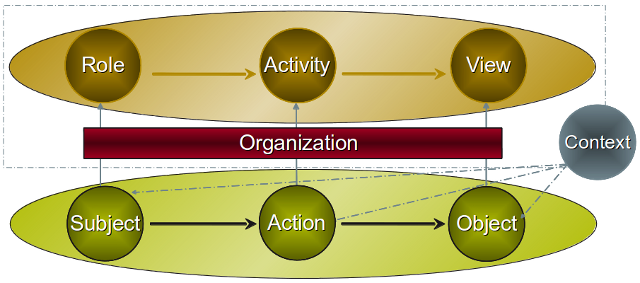

# orbac

The existing approaches to access control and usage control rely on three
entities: subject, action and object. Hence specifying a security policy
consists in specifying security rules applying on the {subject, action, object}
triplet. It can be a permission for some subject to realize some action on some
object. One of the main goals of the OrBAC model is to allow the policy
designer to define a security policy independently of the implementation. The
chosen method to fulfill this goal is the introduction of an abstract level
where the role, activity and view concepts abstract the subject, action and
object concepts.

A role is a set of subjects to which the same security rule apply. Similarly,
an activity is a set of actions to which the same security rule apply and a
view is a set of objects to which the same security rule apply. Each security
policy is defined for and by an organization. A policy is confined in the
organization which defines it. The following figure shows how those concepts
are related:

    

Abstract privileges can be specified using abstract entities. From these
abstract privileges and the association between abstract and concrete entities,
concrete privileges can be derived.

Actually the OrBAC model uses a first order logic formalism with negation.
However, since first order logic is generally undecidable, we have restricted
our model in order to be compatible with a stratified Datalog program. A
stratified Datalog program can be evaluated in polynomial time. In the
following we use a Prolog-like notation where terms beginning with an upper
case are variables and terms beginning with a lower case are constants. The
fact _parent(john, jessica)_ says that _john_ is a parent of _jessica_. A rule
such as _grandparent(X, Z) :- parent(X, Y), parent(Y, Z)_ means that X is a
grandparent of Z if Y exists such that X is a parent of Y and Y is a parent of
Z.

Using this formalism, each organization specifies its own security rules. Some
_role_ may have the permission, prohibition or obligation to do some _activity_
on some _view_ given an associated _context_ is true. The _context_ concept has
been introduced in OrBAC in order to express dynamic rules. Those security
rules are represented using 5-ary predicates:

- _permission(org, role, activity, view, context)_ means that in organization
  _org_, role _role_ is authorized to perform activity _activity_ on view
  _view_ if context _context_ is true.
- _prohibition_ and _obligation_ predicates are similarly defined but express
  different security requirements. The _prohibition_ predicate states that a
  _role_ is not authorized to perform some _activity_ on some _view_ when a
  given _context_ is true. The _obligation_ predicate means that some _role_
  must do some _activity_ on some _view_ when the associated _context_ is true.

For example, the expression

    permission(hospital, nurse, consult, medical_record, emergency)

means that nurses can access the patients medical records in the context of an
emergency. Security rules can be hierarchically structured so that they are
inherited in the organization, role, activity and view hierarchies. Since a
security policy can be inconsistent because of conflicting security rules (for
example a permission can be in conflict with a prohibition), it is necessary to
define strategies to solve those conflicts.

Once the security policy has been specified at the organizational level, it is
possible to instantiate it by assigning concrete entities to abstract entities.
To do so, three ternary predicates have been defined to assign a subject to a
role, an action to an activity and an object to a view:

- _empower(org, subject, role)_: specifies that in organization _org_, subject
  _subject_ is empowered in role _role_.
- _consider(org, action, activity)_: specifies that in organization _org_,
  action _action_ implements activity _activity_.
- _use(org, object, view)_: specifies that in organization _org_, object
  _object_ is used in view _view_.

For example, the fact _empower(hospital, john, surgeon)_ states that _john_ is
empowered in the role _surgeon_ in the _hospital_ organization.

Contexts are defined through logical rules which express the condition that
must be true in order for the context to be active. In the OrBAC model such
rules have the predicate _hold_ in their conclusion: _hold(org, subject,
action, object, context)_ specifies that in organization _org_, subject
_subject_ does action _action_ on object _object_ in context _context_.
Contexts can be combined in order to express conjunctive contexts, disjunctive
contexts and context negation.

Using this model, concrete security rules applying to subject, actions and
objects can be inferred as specified by the following derivation rule:

    is_permitted(Subject, Action, Object):-
        permission(Org, Role, Activity, View, Context),
        empower(Org, Subject, Role),
        consider(Org, Action, Activity),
        use(Org, Object, View),hold(Org, Subject, Action, Object, Context).

Similar rules are defined to infer the _is_prohibited_ and _is_obliged_
predicates which represent concrete prohibitions and concrete obligations.

# orignal article

This article is actually from [orbac.org][orbac]. The link is dead, but it's
archived [here][archive].

[orbac]: http://orbac.org/?page_id=21
[archive]: https://web.archive.org/web/20180214211324/http://orbac.org/?page_id=21
